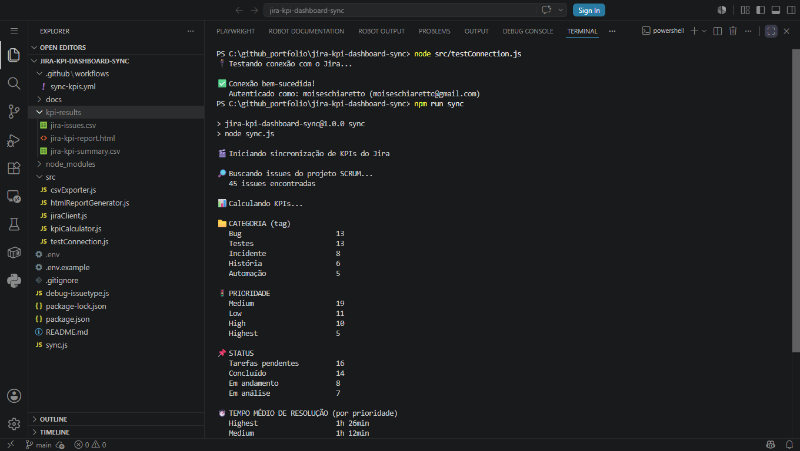
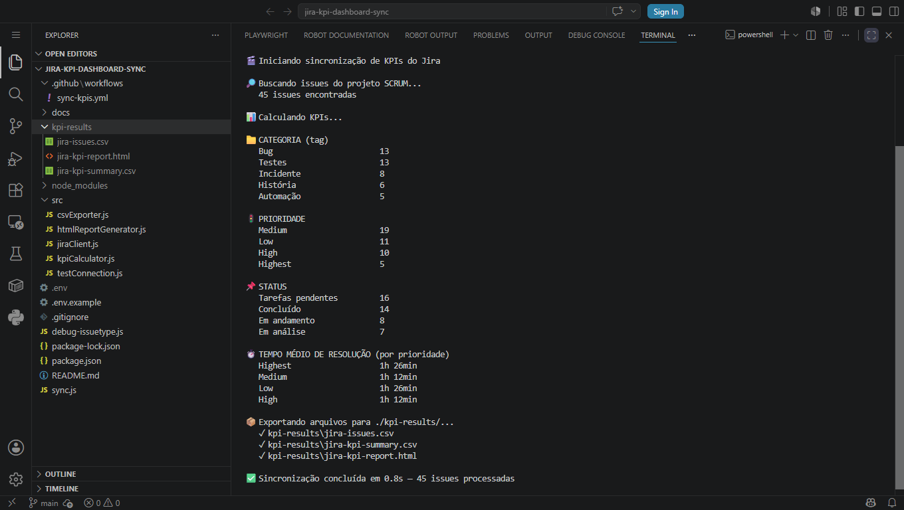
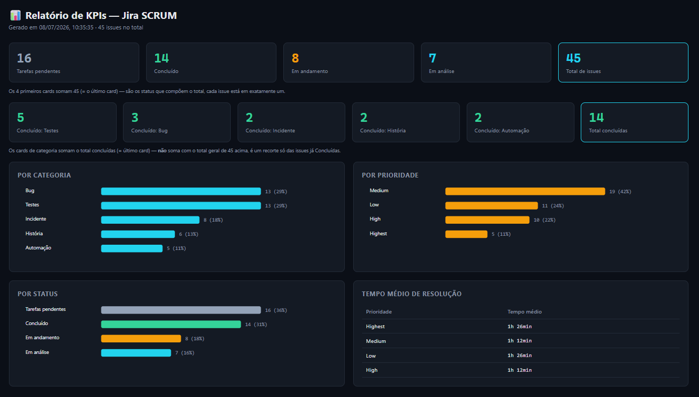
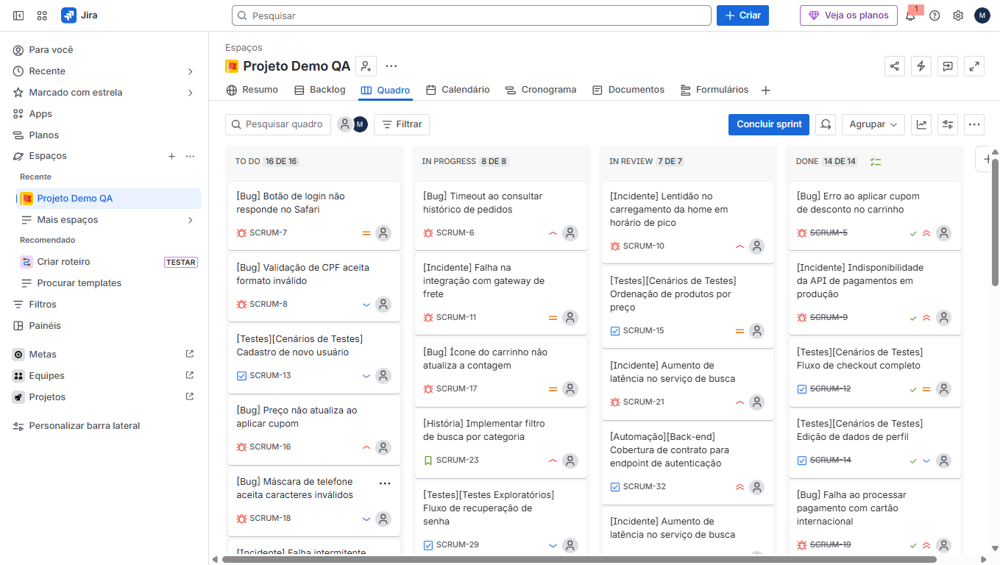
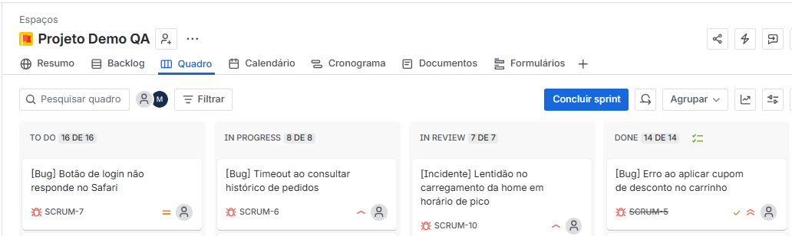

# Jira KPI Dashboard Sync

Extrai issues do Jira via API REST v3, calcula KPIs (por categoria, tipo, prioridade, status e tempo de resolução) e exporta para CSV + relatório HTML visual — pronto para apresentar para a equipe ou importar no Google Sheets e alimentar um dashboard no **Looker Studio**.


## 🚀 Como Começar

### 1. Clone o repositório

```bash
git clone https://github.com/moiseschiaretto/jira-kpi-dashboard-sync.git
cd jira-kpi-dashboard-sync
```

### 2. Instale as dependências

```bash
npm install
```

### 3. Configure o ambiente

```bash
cp .env.example .env
```

Edite o `.env` com:
- `JIRA_BASE_URL` — URL do seu site Jira (ex: `https://seu-site.atlassian.net`)
- `JIRA_EMAIL` — e-mail da conta usada para gerar o token
- `JIRA_API_TOKEN` — gerado em [id.atlassian.com/manage-profile/security/api-tokens](https://id.atlassian.com/manage-profile/security/api-tokens)
- `JIRA_PROJECT_KEY` — chave do projeto (ex: `SCRUM`, se as issues forem `SCRUM-1`, `SCRUM-2`...)

> ⚠️ **Nunca commite o `.env`** — ele já está no `.gitignore`. O token dá acesso à sua conta Jira; trate como senha. Se for exposto acidentalmente, revogue-o imediatamente e gere um novo.

### 4. Teste a conexão (opcional, mas recomendado)

```bash
node src/testConnection.js
```

Se aparecer `✅ Conexão bem-sucedida!`, está tudo certo para rodar a sincronização completa.

### 5. Rode a sincronização

```bash
npm run sync
```

Isso gera, dentro de `kpi-results/`:
- `jira-issues.csv` — dados brutos, uma linha por issue
- `jira-kpi-summary.csv` — KPIs já agregados (para importar no Google Sheets)
- **`jira-kpi-report.html`** — relatório visual, com cards e gráficos, pronto para abrir direto no navegador (duplo clique, sem servidor) e apresentar para a equipe

---

## 📸 Execução real

**Conexão + KPIs calculados no console (parte 1 — categoria, prioridade):**



**KPIs no console (parte 2 — status, tempo médio de resolução, arquivos exportados):**



**Relatório HTML — visão geral com cards e gráficos:**



---

## ✅ Validação do ciclo: Jira → Relatório

Pra provar que o relatório reflete fielmente o que está no Jira (e não é só uma tela bonita solta), aqui está o quadro real do projeto, lado a lado com os números que o script calculou:





**Conferência manual, coluna por coluna:**

| Coluna no Jira | Quantidade no board | Status no relatório | Quantidade no relatório |
|---|---|---|---|
| TO DO | 16 | Tarefas pendentes | 16 ✓ |
| IN PROGRESS | 8 | Em andamento | 8 ✓ |
| IN REVIEW | 7 | Em análise | 7 ✓ |
| DONE | 14 | Concluído | 14 ✓ |
| **Total** | **45** | **Total de issues** | **45 ✓** |

Os 4 números batem exatamente — o relatório não recalcula nem interpreta nada diferente do que já está registrado no Jira, só reorganiza e visualiza os mesmos dados.

---

## O que o script faz

1. **Busca** todas as issues do projeto configurado, via `/rest/api/3/search/jql` (o endpoint atual do Jira Cloud — o antigo `/search` foi descontinuado pela Atlassian em 2025)
2. **Extrai a categoria** de cada issue a partir de tags no início do Resumo — ex: `[Bug]`, `[Automação][Back-end]`, `[Testes][Cenários de Testes]`
3. **Calcula KPIs**: contagem por categoria, tipo, prioridade, status, e tempo médio de resolução (dias) por prioridade
4. **Exibe um resumo no console**, organizado por dimensão
5. **Exporta 3 arquivos** em `kpi-results/`:
   - `jira-issues.csv` — uma linha por issue, com todos os campos
   - `jira-kpi-summary.csv` — os KPIs já agregados, prontos para virar gráfico no Sheets
   - `jira-kpi-report.html` — relatório visual autocontido (cards + gráficos de barra em SVG puro), abre direto no navegador sem precisar de servidor

## Convenção de tags

Cada issue tem uma ou mais tags no início do campo Resumo, entre colchetes:

| Tag | Uso |
|---|---|
| `[Bug]` | Defeitos encontrados |
| `[Incidente]` | Problemas em produção/ambiente |
| `[História]` | Itens de backlog de produto |
| `[Testes][Cenários de Testes]` | Cenários de teste documentados |
| `[Testes][Testes Exploratórios]` | Sessões de teste exploratório |
| `[Automação][Back-end]` | Cobertura de automação de API |
| `[Automação][Front-end][E2E]` | Cobertura de automação E2E |
| `[Automação][Performance]` | Testes de carga/performance (k6) |

O `kpiCalculator.js` usa a **primeira tag** de cada issue para definir a categoria principal no agrupamento.

## Levando os dados para o Looker Studio

1. Abra o `kpi-results/jira-kpi-summary.csv` (ou o `jira-issues.csv`, se preferir montar os gráficos a partir dos dados brutos)
2. Importe numa planilha do Google Sheets (Arquivo → Importar → Fazer upload)
3. Em [lookerstudio.google.com](https://lookerstudio.google.com), crie um relatório em branco
4. Conecte a fonte de dados → Google Sheets → selecione a planilha
5. Monte os gráficos (barras, pizza, tabela) arrastando os campos — sem necessidade de código

## Estrutura

```
src/
  jiraClient.js         # autentica e busca issues via API REST v3 (paginação por nextPageToken)
  kpiCalculator.js       # extrai tags do resumo e calcula os KPIs agregados
  csvExporter.js          # gera os 2 arquivos CSV a partir das issues e dos KPIs
  htmlReportGenerator.js  # gera o relatório HTML visual (cards + gráficos SVG)
  testConnection.js       # valida as credenciais antes de rodar a sincronização completa
sync.js                  # orquestra: busca → calcula → exibe no console → exporta CSV + HTML
.github/workflows/
  sync-kpis.yml            # roda a sincronização automaticamente todo dia (GitHub Actions)
docs/
  screenshots/              # capturas de tela da execução e do relatório
kpi-results/                  # arquivos gerados a cada execução (não versionado)
```

## CI/CD

O workflow (`.github/workflows/sync-kpis.yml`) roda automaticamente todo dia às 08:00 UTC, e também pode ser disparado manualmente pela aba **Actions** do GitHub. As credenciais do Jira ficam armazenadas como **Secrets** do repositório (`Settings → Secrets and variables → Actions`), nunca expostas no código.

## Segurança

- O `.env` nunca é commitado
- O API Token do Jira deve ser tratado como senha — se for exposto acidentalmente (ex: colado em algum lugar público), revogue-o imediatamente em [id.atlassian.com/manage-profile/security/api-tokens](https://id.atlassian.com/manage-profile/security/api-tokens) e gere um novo
